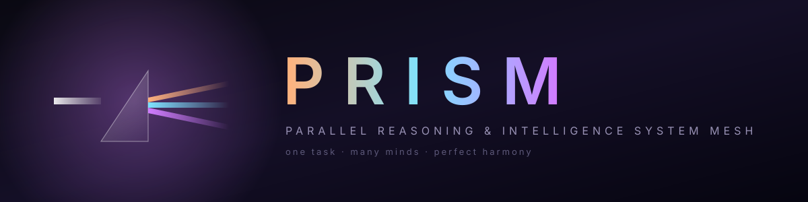

<div align="center">

# PRISM
### Parallel Reasoning & Intelligence System Mesh

**A local multi-model AI war room.**

PRISM coordinates different AI seats, shows who did what, keeps disagreement visible, and tries to avoid expensive model calls when they are not needed.



[](./LICENSE)
[](https://www.python.org/)

</div>

---

## What PRISM is becoming

PRISM started as a lightweight local bridge between multiple model providers.

The current direction is more specific:

> **Use the smallest council that can produce a verified answer.**

That means PRISM should not call three expensive models simply because it can.

Instead it should:
- start cheap when appropriate;
- escalate when uncertainty or risk justifies it;
- preserve model disagreement;
- show cost/latency/provenance;
- persist mission history;
- eventually verify claims with deterministic checks and evidence.

The research and roadmap are in:
- [PRISMSESSION.md](./PRISMSESSION.md)
- [docs/WAR_ROOM_RESEARCH.md](./docs/WAR_ROOM_RESEARCH.md)

---

## Current features

| Feature | Current state |
|---|---|
| Local FastAPI + WebSocket runtime | Working |
| Claude adapter | Working when configured |
| OpenAI-compatible adapter | Working; may point at OpenAI-compatible local/cloud endpoints |
| Optional third Anthropic-wire-compatible seat | Explicit configuration required; no silent fallback |
| Live streaming | Working |
| Per-agent token/cost/latency telemetry | Working as adapter-side estimates |
| Conditional cascade | Working: stronger seat is skipped unless first pass emits `[ESCALATE]` |
| War Room strategy | Working: skeptical analyst + practical operator + low-cost chair |
| Durable local run journal | JSONL reloads across restart |
| Stable run IDs | Working |
| Executed/skipped step tracking | Working |
| Shared vector/semantic cache | Planned |
| General tool execution + receipts | Planned |
| Human approval gates | Planned |
| Dynamic capability registry | Planned |
| Cross-machine specialist nodes | Planned |

---

## Strategies

PRISM currently exposes six routing strategies.

### `cascade` — recommended default
A cheaper seat tries first.

If its answer begins with:

```
[ESCALATE]
```

PRISM runs Claude as the stronger escalation seat.

If not, Claude is skipped.

This is the first real efficiency gate in PRISM.

### `war-room`
Two independent perspectives run:
- **skeptic** — stronger reasoning / hidden-risk review;
- **operator** — practical / implementation-focused view.

A lower-cost chair receives both reports and returns:

- CONSENSUS
- DISAGREEMENT
- DECISION/OUTPUT
- VERIFY NEXT

The chair is instructed not to erase unresolved disagreement.

### `draft-polish`
OpenClaw drafts; Claude polishes.

### `parallel-specialist`
Reasoning, structure, and creative/UX seats run independently in parallel.

Their output remains visibly separate; PRISM does not pretend a merge happened when it did not.

### `vote-of-three`
Three independent answers are shown.

Current behavior intentionally **does not claim a mathematical majority or verified consensus**. A real evidence-aware disagreement engine is planned.

### `context-share`
A cheaper seat compresses the context into a compact brief, then the stronger seat acts on that brief.

This is the beginning of the future Context Broker.

---

## Quickstart

```bash
git clone https://github.com/ingenuousmorpheus/PRISM.git
cd PRISM
pip install -r requirements.txt
cp .env.example .env
python backend/server.py
```

Windows users can run:

```
run.bat
```

Default local UI:

```
http://127.0.0.1:7369
```

---

## Configuration

Example:

```env
CLAUDE_API_KEY=
CLAUDE_MODEL=claude-sonnet-4-5
CLAUDE_BASE_URL=https://api.anthropic.com/v1

OPENCLAW_API_KEY=
OPENCLAW_MODEL=gpt-4o-mini
OPENCLAW_BASE_URL=https://api.openai.com/v1

# Optional third seat.
# Both key and model must be explicitly configured.
MYTHOS_API_KEY=
MYTHOS_MODEL=
MYTHOS_BASE_URL=https://api.anthropic.com/v1

DEFAULT_STRATEGY=cascade
PRISM_HOST=127.0.0.1
PRISM_PORT=7369
```

PRISM does not silently substitute Claude for the optional third seat.

---

## Efficiency philosophy

PRISM should optimize for more than token price.

Future routing decisions should consider:
- task complexity;
- risk;
- model capability;
- latency;
- provider health;
- privacy/local-only requirements;
- available cache;
- disagreement;
- verification results;
- remaining budget.

The long-term metric is:

> **cost per verified successful mission**

not merely cost per token.

---

## Planned War Room layers

1. **Mission Ledger** — durable run/step/model/evidence records.
2. **Capability Registry** — exact provider/model/health/cost/tool capabilities.
3. **Adaptive Router** — explainable model selection + fallback.
4. **Evidence & Validators** — tests, schemas, source checks, file hashes, receipts.
5. **Disagreement Engine** — convene extra models only when material uncertainty remains.
6. **Context Broker** — shared digest + role-specific context slices + cache.
7. **Human Gates** — explicit approval for consequential external actions.
8. **Distributed Specialist Nodes** — safe bounded reasoning workers on other machines.
9. **Benchmark Lab** — compare cost, latency, retries and verified success.

See [docs/WAR_ROOM_RESEARCH.md](./docs/WAR_ROOM_RESEARCH.md) for the full design.

---

## Current limitations

PRISM is still early.

Important limits:
- cost numbers are estimates, not provider invoices;
- no semantic cache yet;
- no generic tool execution layer yet;
- no durable approval workflow yet;
- the UI still assumes three named seats in several places;
- the optional third seat must be configured manually;
- "vote-of-three" is a comparison strategy, not a verified majority engine;
- deterministic validators and receipt-based completion are still planned.

These are roadmap items rather than hidden assumptions.

---

## License

MIT. 🖤
